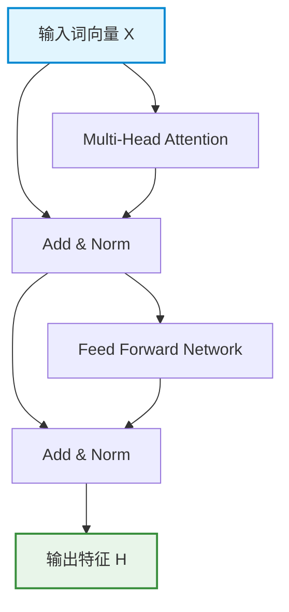

## 1. 简介

在自然语言处理与推荐系统中，**Transformer** 已经成为了主流的骨干网络。它的核心在于两个关键组件：**自注意力层 (Self-Attention)** 和 **前馈神经网络 (Feed-Forward Network, FFN)**。

本篇博客旨在测试博客的数学公式渲染（KaTeX）能力和架构图绘制（Mermaid）能力。

---

## 2. Transformer 编码器结构图

首先，我们可以用纯文本画出一个 Transformer Block 的基本构成（得益于博客的 `mermaid` 渲染支持）：



如上图所示，Transformer 的每一层都由两个主要的子层组成。

---

## 3. Self-Attention 核心公式

自注意力机制允许网络理解长距离上下文。其核心公式为缩放的点积注意力（Scaled Dot-Product Attention）：

$$
\text{Attention}(Q, K, V) = \text{softmax}\left(\frac{QK^T}{\sqrt{d_k}}\right)V
$$

其中：
- $Q$ 代表 Query（查询向量）的矩阵表示。
- $K$ 代表 Key（键向量）的矩阵表示。
- $V$ 代表 Value（值向量）的矩阵表示。
- $\sqrt{d_k}$ 是缩放因子，用于防止 softmax 函数进入梯度极小的饱和区。

如果表示为单个头的代码逻辑，大概如下：

```python
import torch
import torch.nn.functional as F
import math

def scaled_dot_product_attention(q, k, v):
    d_k = q.size(-1)
    # 计算 Q 和 K 的点积，并缩放
    scores = torch.matmul(q, k.transpose(-2, -1)) / math.sqrt(d_k)
    # 对最后一个维度进行 softmax 操作得到注意力权重
    p_attn = F.softmax(scores, dim=-1)
    # 最后乘上 V
    return torch.matmul(p_attn, v), p_attn
```

---

## 4. FFN (Feed-Forward Network)

FFN 是一个分别独立应用于每个位置的逐位置两层全连接网络，中间通常使用 ReLU（或 GELU）激活函数：

$$
\text{FFN}(x) = \max(0, xW_1 + b_1)W_2 + b_2
$$

在此过程中，输入的特征维度通常从模型维度 $d_{model}$ 被映射到更大的隐藏层维度 $d_{ff}$（如 4 倍放大），随后再被降维回 $d_{model}$，这极大地增强了模型的非线性表达能力。

> **小结**：通过这篇文章，我们成功在博客中渲染了复杂的数学公式与基于 Mermaid 的 Transformer 层结构图，说明我们的学术阅读环境已经配置妥当！
